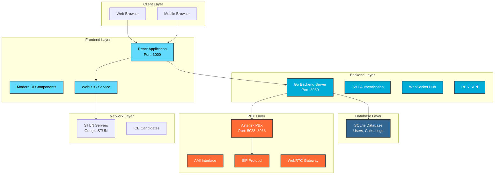
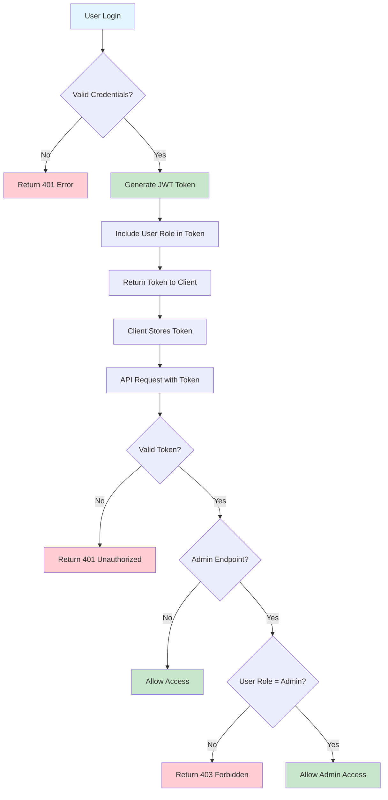
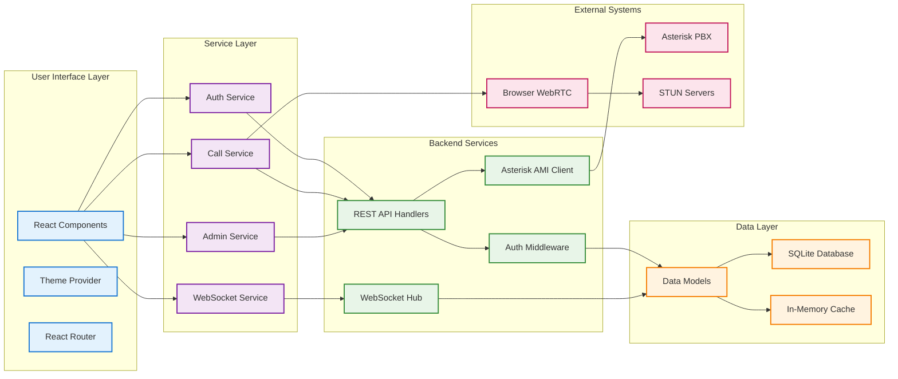
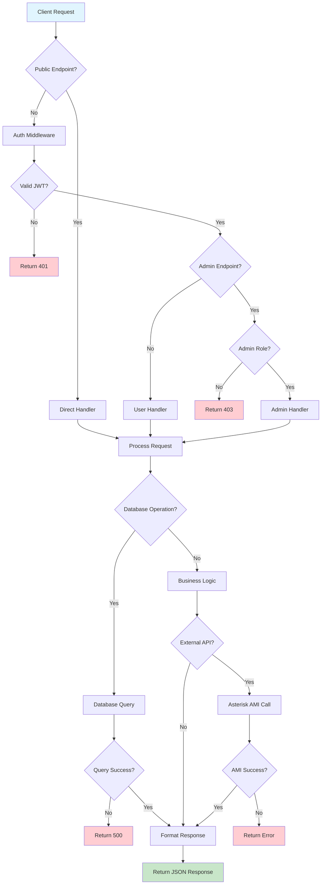

# Enterprise VoIP Web Application

A comprehensive, modern VoIP (Voice over Internet Protocol) web application built with React frontend and Go backend, integrated with Asterisk PBX for enterprise-grade voice communications.


## Overview

This enterprise-grade VoIP application provides a complete voice communication solution with modern web technologies. It features real-time calling, user management, call logging, and administrative controls, all accessible through an intuitive web interface.

### Key Highlights

- **Modern WebRTC Technology** - Browser-based calling without plugins
- **Enterprise Security** - JWT authentication and role-based access
- **Comprehensive Admin Panel** - User management and system monitoring
- **Responsive Design** - Works on desktop, tablet, and mobile devices
- **Real-time Communication** - WebSocket-based instant notifications
- **Call Analytics** - Detailed call logs and system statistics
- **Professional UI/UX** - Modern design with dark/light themes

## System Architecture



### Data Flow Diagram

```mermaid
sequenceDiagram
    participant U as User Browser
    participant F as React Frontend
    participant B as Go Backend
    participant DB as SQLite Database
    participant A as Asterisk PBX
    participant T as Target User

    Note over U,T: Authentication Flow
    U->>F: Login Request
    F->>B: POST /api/login
    B->>DB: Validate Credentials
    DB-->>B: User Data
    B-->>F: JWT Token + User Info
    F-->>U: Login Success

    Note over U,T: Call Initiation Flow
    U->>F: Click Call Button
    F->>B: POST /protected/call/initiate (JWT)
    B->>B: Validate JWT & Extract User
    B->>DB: Log Call Attempt
    B->>A: AMI Originate Command
    B->>T: WebSocket Notification
    T->>B: Accept/Reject Call
    B->>DB: Update Call Status
    B->>U: WebSocket Status Update

    Note over U,T: WebRTC Negotiation
    U->>F: WebRTC Offer Creation
    F->>B: WebSocket Offer Message
    B->>T: Forward Offer via WebSocket
    T->>B: WebRTC Answer
    B->>U: Forward Answer via WebSocket

    Note over U,T: ICE Candidate Exchange
    U->>F: Generate ICE Candidates
    F->>B: WebSocket ICE Message
    B->>T: Forward ICE Candidates
    T->>B: Return ICE Candidates
    B->>U: Forward ICE Candidates

    Note over U,T: Call Established
    U<-->T: Direct P2P Audio Stream
    B->>DB: Update Call Duration

    Note over U,T: Call Termination
    U->>F: Hangup Call
    F->>B: POST /protected/call/hangup
    B->>DB: Log Call End & Duration
    B->>T: WebSocket Call Ended
    B->>A: AMI Hangup Command
```

### Authentication & Authorization Flow



### WebSocket Communication Flow

```mermaid
sequenceDiagram
    participant C1 as Caller Browser
    participant WS1 as Caller WebSocket
    participant B as Go Backend
    participant WS2 as Target WebSocket
    participant C2 as Target Browser

    Note over C1,C2: WebSocket Connection Establishment
    C1->>WS1: Connect ws://localhost:8080/ws?extension=1001
    WS1->>B: Register Client (Extension: 1001)
    C2->>WS2: Connect ws://localhost:8080/ws?extension=1002
    WS2->>B: Register Client (Extension: 1002)

    Note over C1,C2: Real-time Call Invitation
    C1->>WS1: Initiate Call to 1002
    WS1->>B: WebSocket Message: call_initiate
    B->>B: Process Call Logic
    B->>WS2: Forward Call Invitation
    WS2->>C2: Display Incoming Call UI

    Note over C1,C2: Call Response
    C2->>WS2: Accept/Reject Call
    WS2->>B: WebSocket Message: call_response
    B->>WS1: Forward Response
    WS1->>C1: Update Call Status

    Note over C1,C2: WebRTC Signaling
    C1->>WS1: WebRTC Offer
    WS1->>B: Forward Offer
    B->>WS2: Send Offer
    WS2->>C2: Process Offer
    C2->>WS2: WebRTC Answer
    WS2->>B: Forward Answer
    B->>WS1: Send Answer
    WS1->>C1: Process Answer

    Note over C1,C2: ICE Candidates Exchange
    C1->>WS1: ICE Candidate
    WS1->>B: Forward ICE
    B->>WS2: Send ICE
    WS2->>C2: Add ICE Candidate
    C2->>WS2: ICE Candidate
    WS2->>B: Forward ICE
    B->>WS1: Send ICE
    WS1->>C1: Add ICE Candidate

    Note over C1,C2: Direct P2P Connection
    C1<-->C2: Direct Audio Stream (P2P)

    Note over C1,C2: Call Status Updates
    B->>WS1: Call Connected Status
    B->>WS2: Call Connected Status
    WS1->>C1: Update UI (Connected)
    WS2->>C2: Update UI (Connected)
```

### System Component Interaction



### API Request Flow



### Complete System Data Flow Summary

The VoIP application follows a comprehensive data flow pattern:

1. **Authentication Layer**: JWT-based authentication with role-based access control
2. **API Layer**: RESTful endpoints with middleware protection
3. **Real-time Layer**: WebSocket connections for instant communication
4. **Database Layer**: SQLite for persistent data storage
5. **PBX Integration**: Asterisk AMI for traditional telephony features
6. **WebRTC Layer**: Browser-to-browser direct communication

**Key Data Flows:**
- **User Authentication**: Login → JWT Generation → Token Validation → Role-based Access
- **Call Initiation**: UI Action → API Call → Database Logging → WebSocket Notification
- **WebRTC Signaling**: Offer/Answer Exchange → ICE Candidates → P2P Connection
- **Real-time Updates**: WebSocket Hub → Multi-client Broadcasting → UI Updates
- **Admin Operations**: Role Validation → Database Operations → System Monitoring

## Features Overview

### User Management
- **User Registration & Authentication** - Secure JWT-based login system
- **Role-Based Access Control** - Admin and regular user roles
- **Extension Management** - Automatic extension assignment (1000-1005)
- **User Status Tracking** - Online/offline status monitoring
- **Profile Management** - User profile updates and settings

### Calling Features
- **WebRTC Calling** - Browser-to-browser voice calls
- **Real-time Call Status** - Live call progress updates
- **Incoming Call Notifications** - Visual and audio call alerts
- **Call History** - Comprehensive call logging and history
- **Multiple Call Methods** - WebRTC, SIP.js, and Asterisk AMI support
- **Call Controls** - Answer, reject, hold, transfer, and hangup

### Admin Dashboard
- **System Overview** - Real-time system statistics and metrics
- **User Management** - Create, edit, delete, and manage users
- **Call Monitoring** - Monitor active calls and call history
- **System Diagnostics** - Health checks and system status
- **Call Log Management** - View, filter, and export call logs
- **CSV Export** - Export data for reporting and analysis

### User Interface
- **Modern Design** - Clean, professional interface
- **Responsive Layout** - Works on all device sizes
- **Dark/Light Themes** - User preference theme switching
- **Real-time Updates** - Live status and notification updates
- **Accessibility** - WCAG compliant design
- **Mobile Optimized** - Touch-friendly mobile interface

### Technical Features
- **WebSocket Communication** - Real-time bidirectional messaging
- **Browser Compatibility** - Support for modern browsers
- **HTTP/HTTPS Support** - Works with both protocols
- **Error Handling** - Comprehensive error management
- **Logging System** - Detailed application and call logging
- **Configuration Management** - Dynamic configuration loading

## Prerequisites

### System Requirements
- **Operating System**: Windows 10/11, macOS 10.15+, or Linux (Ubuntu 18.04+)
- **Memory**: Minimum 4GB RAM (8GB recommended)
- **Storage**: 2GB free disk space
- **Network**: Stable internet connection for STUN servers

### Software Dependencies
- **Node.js**: Version 16.0 or higher
- **npm**: Version 8.0 or higher (comes with Node.js)
- **Go**: Version 1.21 or higher
- **Git**: For cloning the repository

### Optional (for full PBX integration)
- **Asterisk PBX**: Version 18.0 or higher
- **Linux Server**: For hosting Asterisk (Ubuntu/CentOS recommended)

## Installation Guide

### Method 1: Quick Setup (Recommended)

This method sets up the application with WebRTC-only calling (no Asterisk required).

#### Step 1: Clone the Repository
```bash
git clone https://github.com/Euphrase8/voip-application.git
cd voip-application
```

#### Step 2: Install Frontend Dependencies
```bash
npm install
```

#### Step 3: Install Backend Dependencies
```bash
cd backend
go mod download
cd ..
```

#### Step 4: Start the Application
```bash
# Terminal 1: Start Backend
cd backend
go run main.go

# Terminal 2: Start Frontend
npm start
```

#### Step 5: Access the Application
- Open your browser and navigate to `http://localhost:3000`
- Use default credentials or register a new account
- Start making WebRTC calls between extensions!

**Default User Accounts:**
| Username | Password | Extension | Role | Access Level |
|----------|----------|-----------|------|--------------|
| `admin` | `password` | `1000` | `admin` | Full admin access |
| `user1` | `password` | `1001` | `user` | Regular user |
| `user2` | `password` | `1002` | `user` | Regular user |
| `user3` | `password` | `1003` | `user` | Regular user |

> **Note**: For admin dashboard access, use the `admin` account. Regular users can only access user features.

### Method 2: Full Setup with Asterisk PBX

For enterprise deployment with full PBX integration.

#### Step 1: Prepare Asterisk Server

**On Ubuntu/Debian:**
```bash
# Update system
sudo apt update && sudo apt upgrade -y

# Install Asterisk
sudo apt install asterisk asterisk-modules asterisk-config -y

# Start Asterisk service
sudo systemctl start asterisk
sudo systemctl enable asterisk
```

**On CentOS/RHEL:**
```bash
# Install EPEL repository
sudo yum install epel-release -y

# Install Asterisk
sudo yum install asterisk asterisk-configs -y

# Start Asterisk service
sudo systemctl start asterisk
sudo systemctl enable asterisk
```

#### Step 2: Configure Asterisk

Copy the provided configuration files:
```bash
# Copy configuration files to Asterisk
sudo cp asterisk-config/* /etc/asterisk/

# Set proper permissions
sudo chown asterisk:asterisk /etc/asterisk/*
sudo chmod 640 /etc/asterisk/*

# Restart Asterisk
sudo systemctl restart asterisk
```

#### Step 3: Configure Network Settings

Update the configuration for your network:
```bash
# Edit backend configuration
cd backend
cp config/config.example.yaml config/config.yaml

# Update with your Asterisk server IP
nano config/config.yaml
```

#### Step 4: Start Services
```bash
# Start backend with Asterisk integration
cd backend
go run main.go

# Start frontend
cd ..
npm start
```

## Configuration

### Environment Variables

Create a `.env` file in the root directory:
```env
# Frontend Configuration
REACT_APP_API_URL=http://localhost:8080
REACT_APP_WS_URL=ws://localhost:8080/ws
REACT_APP_SIP_SERVER=your-asterisk-server-ip

# Backend Configuration (backend/.env)
DB_PATH=./voip.db
JWT_SECRET=your-super-secret-jwt-key
ASTERISK_HOST=your-asterisk-server-ip
ASTERISK_AMI_PORT=5038
ASTERISK_AMI_USERNAME=admin
ASTERISK_AMI_PASSWORD=your-ami-password
```

### Network Configuration

#### For Local Development
```yaml
# config/config.yaml
server:
  host: "localhost"
  port: 8080

asterisk:
  host: "localhost"  # or your Asterisk server IP
  ami_port: 5038
  http_port: 8088
```

#### For Production Deployment
```yaml
# config/config.yaml
server:
  host: "0.0.0.0"
  port: 8080

asterisk:
  host: "your-asterisk-server-ip"
  ami_port: 5038
  http_port: 8088

security:
  jwt_secret: "your-production-jwt-secret"
  cors_origins: ["https://your-domain.com"]
```

## Usage Guide

### Getting Started

#### 1. First Time Setup
1. **Access the Application**: Navigate to `http://localhost:3000`
2. **IP Configuration**: On first run, configure your Asterisk server IP
3. **Register Account**: Create a new user account
4. **Extension Assignment**: System automatically assigns extension (1000-1005)

#### 2. Making Your First Call
1. **Login**: Use your credentials to access the dashboard
2. **Find Contact**: Use the contacts page or dial directly
3. **Initiate Call**: Click the call button or use the dialer
4. **Accept Incoming**: Answer incoming calls with the green button

#### 3. Admin Functions
1. **Access Admin Panel**: Login with admin credentials (`admin`/`password`)
2. **Manage Users**: Create, edit, or delete user accounts
3. **Monitor Calls**: View active calls and call history
4. **System Health**: Check system status and diagnostics

**Quick Admin Tasks:**
- **View System Stats**: Navigate to Admin Dashboard → Statistics
- **Create New User**: Admin Panel → Users → Create User
- **Monitor Active Calls**: Admin Panel → Call Monitoring
- **Export Call Logs**: Admin Panel → Call Logs → Export CSV
- **System Diagnostics**: Admin Panel → Health Check

### User Interface Guide

#### Dashboard Overview
```
┌─────────────────────────────────────────────────────┐
│ Dashboard    Calls    Contacts    Logs              │
├─────────────────────────────────────────────────────┤
│                                                     │
│  Quick Stats           Notifications                │
│  ┌─────────────────┐   ┌─────────────────────────┐   │
│  │ Active Calls: 2 │   │ Incoming call from      │   │
│  │ Online Users: 5 │   │    John Doe (Ext 1001) │   │
│  │ Total Calls: 47 │   │    [Accept] [Reject]    │   │
│  └─────────────────┘   └─────────────────────────┘   │
│                                                     │
│  Quick Actions                                      │
│  ┌─────────────────────────────────────────────────┐ │
│  │ [Make Call] [Contacts] [Call Logs]              │ │
│  └─────────────────────────────────────────────────┘ │
└─────────────────────────────────────────────────────┘
```

#### Call Interface
```
┌─────────────────────────────────────────────────────┐
│                 Calling John Doe                    │
│                   Extension: 1001                   │
├─────────────────────────────────────────────────────┤
│                                                     │
│              ┌─────────────────┐                    │
│              │       JD        │                    │
│              │   (Avatar)      │                    │
│              └─────────────────┘                    │
│                                                     │
│              Status: Connecting...                  │
│              Duration: 00:00:00                     │
│                                                     │
│  ┌─────┐  ┌─────┐  ┌─────┐  ┌─────┐  ┌─────┐       │
│  │Mute │  │Hold │  │Call │  │End  │  │Spkr │       │
│  └─────┘  └─────┘  └─────┘  └─────┘  └─────┘       │
└─────────────────────────────────────────────────────┘
```

### API Documentation

#### Authentication Endpoints

**POST /api/register**
```json
{
  "username": "john_doe",
  "email": "john@example.com",
  "password": "securepassword",
  "extension": "1001"
}
```

**POST /api/login**
```json
{
  "username": "john_doe",
  "password": "securepassword"
}
```

**POST /api/refresh**
```json
{
  "refresh_token": "your-refresh-token"
}
```

#### Call Management Endpoints

**POST /protected/call/initiate**
```json
{
  "target_extension": "1002",
  "method": "webrtc"
}
```

**POST /protected/call/answer**
```json
{
  "channel": "call-channel-id"
}
```

**POST /protected/call/hangup**
```json
{
  "channel": "call-channel-id"
}
```

#### WebSocket Events

**Incoming Call Notification**
```json
{
  "type": "webrtc_call_invitation",
  "call_id": "webrtc-call-123",
  "caller_username": "john_doe",
  "caller_extension": "1001",
  "target_extension": "1002"
}
```

**Call Status Update**
```json
{
  "type": "call_status",
  "status": "connected",
  "call_id": "webrtc-call-123",
  "duration": 45
}
```

#### Admin Endpoints

**GET /protected/admin/users**
```json
{
  "success": true,
  "users": [
    {
      "id": 1,
      "username": "john_doe",
      "email": "john@example.com",
      "extension": "1001",
      "role": "user",
      "created_at": "2025-01-01T00:00:00Z"
    }
  ]
}
```

**GET /protected/admin/stats**
```json
{
  "success": true,
  "stats": {
    "total_users": 10,
    "active_calls": 2,
    "total_calls_today": 25,
    "system_uptime": "2d 5h 30m"
  }
}
```

## Deployment

### Production Deployment

#### Docker Deployment (Recommended)

**1. Create Dockerfile for Backend:**
```dockerfile
FROM golang:1.21-alpine AS builder
WORKDIR /app
COPY backend/ .
RUN go mod download
RUN go build -o voip-backend main.go

FROM alpine:latest
RUN apk --no-cache add ca-certificates
WORKDIR /root/
COPY --from=builder /app/voip-backend .
COPY --from=builder /app/config ./config
EXPOSE 8080
CMD ["./voip-backend"]
```

**2. Create Dockerfile for Frontend:**
```dockerfile
FROM node:18-alpine AS builder
WORKDIR /app
COPY package*.json ./
RUN npm ci --only=production
COPY . .
RUN npm run build

FROM nginx:alpine
COPY --from=builder /app/build /usr/share/nginx/html
COPY nginx.conf /etc/nginx/nginx.conf
EXPOSE 80
CMD ["nginx", "-g", "daemon off;"]
```

**3. Docker Compose Setup:**
```yaml
version: '3.8'
services:
  backend:
    build:
      context: .
      dockerfile: Dockerfile.backend
    ports:
      - "8080:8080"
    environment:
      - DB_PATH=/data/voip.db
      - JWT_SECRET=${JWT_SECRET}
    volumes:
      - ./data:/data
    networks:
      - voip-network

  frontend:
    build:
      context: .
      dockerfile: Dockerfile.frontend
    ports:
      - "80:80"
    depends_on:
      - backend
    networks:
      - voip-network

  asterisk:
    image: andrius/asterisk:18
    ports:
      - "5060:5060/udp"
      - "5038:5038"
      - "8088:8088"
    volumes:
      - ./asterisk-config:/etc/asterisk
    networks:
      - voip-network

networks:
  voip-network:
    driver: bridge
```

#### Manual Deployment

**1. Build Frontend:**
```bash
npm run build
```

**2. Build Backend:**
```bash
cd backend
go build -o voip-backend main.go
```

**3. Deploy to Server:**
```bash
# Copy files to server
scp -r build/ user@server:/var/www/voip-frontend/
scp backend/voip-backend user@server:/opt/voip-backend/

# Setup systemd service
sudo cp voip-backend.service /etc/systemd/system/
sudo systemctl enable voip-backend
sudo systemctl start voip-backend
```

### Cloud Deployment

#### AWS Deployment
- **EC2**: Deploy on Amazon EC2 instances
- **ELB**: Use Elastic Load Balancer for high availability
- **RDS**: Optional PostgreSQL database instead of SQLite
- **CloudFront**: CDN for frontend static files

#### Google Cloud Platform
- **Compute Engine**: VM instances for application
- **Cloud Load Balancing**: Traffic distribution
- **Cloud SQL**: Managed database service
- **Cloud CDN**: Content delivery network

#### Microsoft Azure
- **Virtual Machines**: Application hosting
- **Application Gateway**: Load balancing and SSL termination
- **Azure Database**: Managed database service
- **Azure CDN**: Content delivery

## Development

### Project Structure

```
voip-application/
├── backend/                   # Go backend server
│   ├── asterisk/             # Asterisk AMI integration
│   ├── auth/                 # JWT authentication
│   ├── config/               # Configuration management
│   ├── database/             # Database setup and migrations
│   ├── handlers/             # HTTP request handlers
│   ├── middleware/           # HTTP middleware
│   ├── models/               # Data models
│   ├── websocket/            # WebSocket server
│   ├── main.go               # Application entry point
│   ├── go.mod                # Go module definition
│   └── README.md             # Backend documentation
├── src/                      # React frontend source
│   ├── components/           # Reusable UI components
│   ├── pages/                # Application pages
│   ├── services/             # API and business logic
│   ├── utils/                # Utility functions
│   ├── styles/               # CSS and styling
│   └── assets/               # Static assets
├── public/                   # Public static files
├── asterisk-config/          # Asterisk configuration files
├── docs/                     # Documentation
├── package.json              # Frontend dependencies
├── tailwind.config.js        # Tailwind CSS configuration
└── README.md                 # This file
```

### Development Workflow

#### Setting Up Development Environment

**1. Install Development Tools:**
```bash
# Install Air for Go hot reloading
go install github.com/cosmtrek/air@latest

# Install frontend development dependencies
npm install --save-dev
```

**2. Start Development Servers:**
```bash
# Terminal 1: Backend with hot reload
cd backend
air

# Terminal 2: Frontend with hot reload
npm start

# Terminal 3: Watch for changes
npm run watch
```

#### Code Style and Standards

**Frontend (React/JavaScript):**
- ESLint configuration for code quality
- Prettier for code formatting
- Tailwind CSS for styling
- Component-based architecture

**Backend (Go):**
- Go fmt for code formatting
- Go vet for code analysis
- Structured logging with levels
- RESTful API design

#### Testing

**Frontend Testing:**
```bash
# Run all tests
npm test

# Run tests with coverage
npm run test:coverage

# Run specific test file
npm test -- ContactsPage.test.js
```

**Backend Testing:**
```bash
# Run all tests
cd backend
go test ./...

# Run tests with coverage
go test -cover ./...

# Run specific package tests
go test ./handlers
```

#### Building for Production

**Frontend Build:**
```bash
npm run build
```

**Backend Build:**
```bash
cd backend
go build -ldflags="-s -w" -o voip-backend main.go
```

## Troubleshooting

### Common Issues and Solutions

#### 1. Connection Issues

**Problem**: "No response from server" error
```bash
# Check backend status
curl http://localhost:8080/health

# Check if backend is running
ps aux | grep voip-backend

# Check logs
tail -f backend/logs/app.log
```

**Solution**:
- Ensure backend is running on correct port
- Check firewall settings
- Verify network connectivity

#### 2. Authentication & Authorization Issues

**Problem**: 403 Forbidden errors on admin endpoints
```bash
[GIN] 2025/07/04 - 23:39:02 | 403 | 332µs | 172.20.10.4 | GET "/protected/admin/health"
[GIN] 2025/07/04 - 23:39:02 | 403 | 0s | 172.20.10.4 | GET "/protected/admin/stats"
```

**Root Cause**: User logged in with regular user role instead of admin role

**Solutions**:
1. **Check Current User Role**:
   ```bash
   # Check JWT token payload (decode at jwt.io)
   # Look for "role" field in token
   ```

2. **Login with Admin Credentials**:
   ```bash
   # Default admin credentials:
   Username: admin
   Password: password
   Extension: 1000
   ```

3. **Verify Admin User Exists**:
   ```bash
   # Check database for admin user
   cd backend
   sqlite3 voip.db "SELECT username, role, extension FROM users WHERE role='admin';"
   ```

4. **Create Admin User if Missing**:
   ```bash
   # The system should auto-create admin user on startup
   # Check backend logs for admin user creation message
   tail -f backend/logs/app.log | grep "admin user"
   ```

#### 3. WebRTC Call Issues

**Problem**: Calls not connecting
```javascript
// Check browser console for WebRTC errors
// Look for ICE connection failures
```

**Solutions**:
- Check STUN server connectivity
- Verify microphone permissions
- Test with different browsers
- Check network NAT/firewall settings

#### 3. Asterisk Integration Issues

**Problem**: AMI connection failed
```bash
# Test AMI connection
telnet your-asterisk-ip 5038

# Check Asterisk status
sudo asterisk -r
> manager show connected
```

**Solutions**:
- Verify AMI credentials in configuration
- Check Asterisk manager.conf settings
- Ensure AMI is enabled and running
- Check network connectivity to Asterisk server

#### 4. Database Issues

**Problem**: Database connection errors
```bash
# Check database file permissions
ls -la backend/voip.db

# Test database connectivity
cd backend
go run main.go --test-db
```

**Solutions**:
- Ensure proper file permissions
- Check disk space
- Verify SQLite installation

### Performance Optimization

#### Frontend Optimization
```bash
# Analyze bundle size
npm run build
npm install -g webpack-bundle-analyzer
npx webpack-bundle-analyzer build/static/js/*.js
```

#### Backend Optimization
```bash
# Profile Go application
go tool pprof http://localhost:8080/debug/pprof/profile

# Memory profiling
go tool pprof http://localhost:8080/debug/pprof/heap
```

### Monitoring and Logging

#### Application Logs
```bash
# Backend logs
tail -f backend/logs/app.log

# Frontend logs (browser console)
# Open Developer Tools > Console

# Asterisk logs
sudo tail -f /var/log/asterisk/full
```

#### Health Checks
```bash
# Backend health
curl http://localhost:8080/health

# Asterisk connectivity
curl http://localhost:8080/protected/test-asterisk

# Database status
curl http://localhost:8080/protected/admin/stats
```

## Frequently Asked Questions

### General Questions

**Q: Can I use this without Asterisk?**
A: Yes! The application supports WebRTC-only mode for direct browser-to-browser calling without requiring Asterisk PBX.

**Q: What browsers are supported?**
A: Modern browsers including Chrome 80+, Firefox 75+, Safari 13+, and Edge 80+. WebRTC features require HTTPS in production.

**Q: Can I customize the user interface?**
A: Absolutely! The frontend uses Tailwind CSS and modular components, making customization straightforward.

**Q: Is this suitable for production use?**
A: Yes, with proper security configurations, SSL certificates, and infrastructure setup, this application is production-ready.

### Technical Questions

**Q: How many concurrent calls are supported?**
A: This depends on your server resources and Asterisk configuration. The application itself can handle hundreds of concurrent WebSocket connections.

**Q: Can I integrate with existing PBX systems?**
A: Yes, the application can integrate with any Asterisk-compatible PBX system through AMI and SIP protocols.

**Q: What about security?**
A: The application includes JWT authentication, CORS protection, input validation, and supports HTTPS deployment.

**Q: Can I add video calling?**
A: The WebRTC infrastructure supports video. You can extend the application to include video calling capabilities.

### Deployment Questions

**Q: What are the server requirements?**
A: Minimum 2GB RAM, 2 CPU cores, and 10GB storage. For production, 4GB+ RAM and 4+ CPU cores are recommended.

**Q: Can I deploy on cloud platforms?**
A: Yes, the application supports deployment on AWS, Google Cloud, Azure, and other cloud platforms.

**Q: How do I backup the data?**
A: The SQLite database file can be backed up regularly. For production, consider using PostgreSQL with automated backups.

## Additional Resources

### Documentation
- [Backend API Documentation](backend/README.md)
- [Asterisk Configuration Guide](ASTERISK_CONFIGURATION_GUIDE.md)
- [Troubleshooting Guide](TROUBLESHOOTING_GUIDE.md)
- [Quick Start Guide](QUICK_START_GUIDE.md)

### External Resources
- [WebRTC Documentation](https://webrtc.org/getting-started/)
- [Asterisk Documentation](https://wiki.asterisk.org/)
- [React Documentation](https://reactjs.org/docs/)
- [Go Documentation](https://golang.org/doc/)

### Community and Support
- [GitHub Issues](https://github.com/Euphrase8/voip-application/issues)
- [Discussions](https://github.com/Euphrase8/voip-application/discussions)
- [Wiki](https://github.com/Euphrase8/voip-application/wiki)

## Contributing

We welcome contributions! Please see our [Contributing Guide](CONTRIBUTING.md) for details.

### Development Setup
1. Fork the repository
2. Create a feature branch
3. Make your changes
4. Add tests for new functionality
5. Submit a pull request

### Code of Conduct
Please read our [Code of Conduct](CODE_OF_CONDUCT.md) before contributing.

## License

This project is licensed under the MIT License - see the [LICENSE](LICENSE) file for details.

## Acknowledgments

- **Asterisk Community** - For the robust PBX platform
- **WebRTC Project** - For enabling browser-based real-time communication
- **React Team** - For the excellent frontend framework
- **Go Team** - For the efficient backend language
- **Tailwind CSS** - For the utility-first CSS framework

## Support

For support and questions:
- **Email**: joachim.euphrase@gmail.com
- **Organization**: DevHub
- **Location**: Dar es Salaam, Tanzania
- **Documentation**: [docs.devhub.com](https://docs.devhub.com)
- **Bug Reports**: [GitHub Issues](https://github.com/Euphrase8/voip-application/issues)

---

**Enterprise VoIP Web Application**

*Developed by JOACHIM J. EUPHRASE - DevHub*
*Professional voice communication solution for modern businesses*
